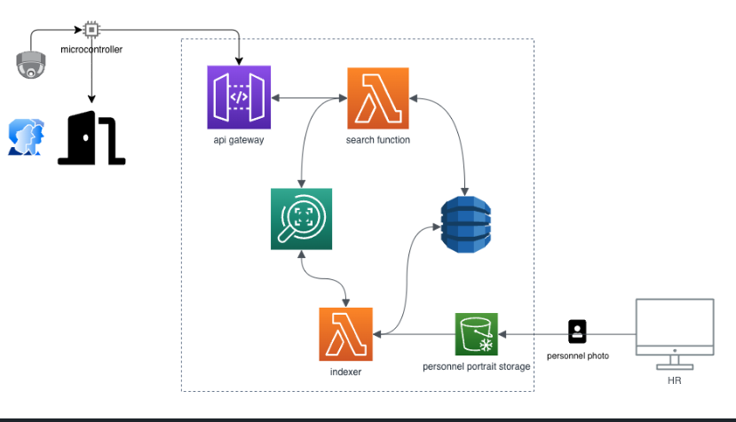

# Building a Serverless Face Analysis Application on AWS using Terraform

## Reference Architecture Diagram



## Terraform Basics
All interactions with Terraform occur via the CLI. Terraform is a local tool (runs on the current machine). The terraform ecosystem also includes providers for many cloud services, and a module repository. Hashicorp also has products to help teams manage Terraform: Terraform Cloud and Terraform Enterprise.

There are a handful of basic terraform commands, including:

`terraform -version` You can get the version of Terraform running on your machine using this command.

`terraform init` Initializing your workspace is used to initialize a working directory containing Terraform configuration files. This tells Terraform to scan your code and download 
                 anything it needs locally. 
                 
`terraform validate`  The terraform validate command validates the configuration files in your working directory.   

`terraform plan` Terraform has a dry run mode where you can preview what Terraform will change without making any actual changes to your infrastructure.

`terraform apply`  Used to build the resources within your plan file.

`terraform help`  You can get a list of available commands and arguments with the help argument.

`terraform destroy` This destroys the resources built from your Terraform code.

These commands make up the terraform workflow


## Installation

Download Code from this repo and open it in your IDE.


The first step to using Terraform is initializing the working directory. In your shell session, type the following command:

```
terraform init
```


As a response, you should see something like the following output (note that the provider version might change):

```
terraform init

Initializing the backend...

Initializing provider plugins...
- Checking for available provider plugins...
- Downloading plugin for provider "aws" (hashicorp/aws) 3.37.0...

Terraform has been successfully initialized!

You may now begin working with Terraform. Try running "terraform plan" to see
any changes that are required for your infrastructure. All Terraform commands
should now work.

If you ever set or change modules or backend configuration for Terraform,
rerun this command to reinitialize your working directory. If you forget, other
commands will detect it and remind you to do so if necessary.
```


Now that our working directory is initialized, we can create a plan for execution. This will provide a preview of the changes to our AWS environment

```
terraform plan
```


For our final step to create our AWS resources, we need to apply the configuration. An apply will instruct Terraform to create the resources in AWS that are defined in our configuration file(s).

```
terraform apply
```


Clean-Up

```
terraform destroy
```


## Reference Resource

**[Official Terraform Providers](https://registry.terraform.io/browse/providers)**

**[Official AWS Terraform Provider](https://registry.terraform.io/providers/hashicorp/aws/latest/docs)**

**[Amazon Rekognition Immersion Day Workshop](https://catalog.us-east-1.prod.workshops.aws/workshops/4a2a9a24-071d-4d96-b9be-0cc57b7db434/en-US)**

**[Detect, Analyze, and Compare Faces with Amazon Rekognition](https://aws.amazon.com/getting-started/hands-on/detect-analyze-compare-faces-rekognition/)**

**[Building a Serverless Face Analysis Application on AWS using Terraform](https://medium.com/@kevintuei/building-a-serverless-face-analysis-application-on-aws-using-terraform-f37c7c390f8d)**

**[Personnel Rekognition System by Mehmet Gungoren](https://github.com/gungoren/personnel-recognition-system/)** 

**[Amazon Q Developer](https://aws.amazon.com/q/)**
